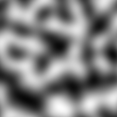

# Pseudo-Random Noise

_[Crow Library by Ross Smith](index.html)_

```c++
#include "crow/noise.hpp"
namespace Crow;
```

## Contents

* TOC
{:toc}

## Noise class

```c++
template <typename T, int N> class Noise;
```

This is based on the [Super Simplex](https://github.com/KdotJPG/OpenSimplex2)
(or Open Simplex 2S) algorithm by KdotJPG. `T` must be a floating point
arithmetic type. `N` is the number of dimensions; currently this is only
implemented for `N=2` and `N=3`.

Please note that this will not produce exactly the same noise pattern as the
original Java code. The seeding algorithm had to be changed slightly because
the original algorithm relied on specific behaviour of signed integer
arithmetic in Java, which is difficult to emulate in C++. Apart from that the
original algorithm is unchanged.

```c++
using Noise::scalar_type = T;
using Noise::seed_type = uint64_t;
using Noise::vector_type = Vector<T, N>;
```

Member types.

```c++
static constexpr int Noise::dim = N;
```

Member constants.

```c++
Noise::Noise();
explicit Noise::Noise(uint64_t s) noexcept;
```

The second constructor is the main constructor, creating and initialising a
noise generator. The default constructor leaves the object uninitialised;
behaviour is undefined if its function call operator is invoked without first
calling `seed()` or assigning from a previously seeded object.

```c++
constexpr Noise::Noise(const Noise& n) noexcept;
constexpr Noise::Noise(Noise&& n) noexcept;
constexpr Noise::~Noise() noexcept;
constexpr Noise& Noise::operator=(const Noise& n) noexcept;
constexpr Noise& Noise::operator=(Noise&& n) noexcept;
```

Other life cycle functions.

```c++
T Noise::operator()(const vector_type& point) const noexcept;
```

The function call operator returns the noise value for the given point. The
output is in the range `[-1,1]`. The standard deviation of the noise value is
about 0.209 for 2D noise, 0.180 for 3D.

```c++
void Noise::seed(uint64_t s) noexcept;
```

This discards the generator's internal state and reconstructs it from a new
random number seed. The new state is the same as a new `Noise` object
initialised from the same seed.

## Generalised noise source

```c++
template <typename T, int DimIn, int DimOut> class NoiseSource
```

This is a more general noise generator, which calls `Noise` internally but
provides more control over the output.

`DimIn` is the dimensionality of the input domain, and must be 1 to 3 (1D
noise is emulated by sampling the X axis of 2D noise). `DimOut` is the
dimensionality of the output, and can be any positive integer; the output
contains this many independently generated noise values.

For the sum of `n` octaves of noise:

* Multiply the output range by _2-1/2<sup>n-1</sup>_
* Multiply standard deviation by _√((1-1/4<sup>n</sup>).4/3)_

| Octaves  | Max value  | SD (1-2D)  | SD (3D)  |
| -------  | ---------  | ---------  | -------  |
| 1        | 1.000      | 0.209      | 0.180    |
| 2        | 1.500      | 0.234      | 0.201    |
| 3        | 1.750      | 0.239      | 0.206    |
| 4        | 1.875      | 0.241      | 0.207    |
| 5        | 1.938      | 0.241      | 0.208    |
| 6        | 1.969      | 0.241      | 0.208    |
| 7        | 1.984      | 0.241      | 0.208    |
| 8        | 1.992      | 0.241      | 0.208    |
| 9        | 1.996      | 0.241      | 0.208    |
| 10       | 1.998      | 0.241      | 0.208    |

```c++
using NoiseSource::scalar_type = T;
using NoiseSource::seed_type = uint64_t;
using NoiseSource::domain_type = std::conditional_t<DimIn == 1, T, Vector<T, DimIn>>;
using NoiseSource::result_type = std::conditional_t<DimOut == 1, T, Vector<T, DimOut>>;
```

Member types. The domain and result types are `T` if `DimIn` or `DimOut`,
respectively, are 1, otherwise `Vector<T,DimIn>` and `Vector<T,DimOut>`.

```c++
static constexpr int NoiseSource::dim_in = DimIn;
static constexpr int NoiseSource::dim_out = DimOut;
```

Member constants.

```c++
NoiseSource::NoiseSource();
NoiseSource::NoiseSource(T cell, T scale, int octaves, uint64_t seed) noexcept;
```

A noise source can be initialised either by calling the second constructor, or
by starting with a default constructed object and then calling `seed()` and
any of `cell()`, `octaves()`, and `scale()` for which a non-default value is
required. The meaning of the individual parameters is explained below, under
the member functions that query or modify them.

The `cell`, `scale`, and `octaves` parameters all default to 1. The default
constructor does not seed the internal noise generator; behaviour is undefined
if the function call operator is invoked on a default constructed object
without an intervening call to `seed()`, or an assignment from an already
seeded noise source.

```c++
constexpr NoiseSource::NoiseSource(const NoiseSource& ns) noexcept;
constexpr NoiseSource::NoiseSource(NoiseSource&& ns) noexcept;
constexpr NoiseSource::~NoiseSource() noexcept;
constexpr NoiseSource& NoiseSource::operator=(const NoiseSource& ns) noexcept;
constexpr NoiseSource& NoiseSource::operator=(NoiseSource&& ns) noexcept;
```

Other life cycle functions.

```c++
result_type NoiseSource::operator()(domain_type point) const noexcept;
```

The function call operator returns a vector of noise values for the given
point.

```c++
T NoiseSource::cell() const noexcept;
void NoiseSource::cell(T size) noexcept;
```

Query or set the size of a unit cell in the domain space. The absolute value
of the argument is used; behaviour is undefined if the size is zero. The
default cell size is 1.

```c++
int NoiseSource::octaves() const noexcept;
void NoiseSource::octaves(int n) noexcept;
```

Query or set the number of octaves of noise to generate and superimpose.
Internally, `Noise::operator()` will be called `octaves()*DimOut` times for
each call to `NoiseSource::operator()`. If `octaves<1`, all output values will
be zero. By default only one octave is generated.

```c++
T NoiseSource::scale() const noexcept;
void NoiseSource::scale(T factor) noexcept;
```

Query or set the output scale; each component of the output vector will be
multiplied by `factor`. The default scale factor is 1. For the sum of many
octaves of simplex noise, this yields an output in the range `(-2,+2)`.

```c++
void NoiseSource::seed(uint64_t s) noexcept;
```

The `seed()` function discards the generator's internal state and reconstructs
it from a new random number seed. This does not reset any of the other state
parameters, and it is not necessary to call `seed()` after changing any of
them, provided it is called at least once before the first call to
`operator()` (the non-default constructor implicitly calls `seed()`).

## Samples ##

The images in each row show 2D noise first, then slices through 3D noise in
the XY, XZ, and YZ planes. Each image covers the coordinate range from -2 to
+2, showing 16 unit cells.

### Single octave ###




### Multiple octaves ###


