# Map Projections

_[Crow Library by Ross Smith](index.html)_

```c++
#include "crow/projection.hpp"
namespace Crow;
```

## Contents

* TOC
{:toc}

## Constants

```c++
enum class Maps: uint32_t;
std::string to_string(Maps m);
std::ostream& operator<<(std::ostream& out, Maps m);
```

Type used for bitmask flags.

| Flag                       | Description                                                                                         |
| ----                       | -----------                                                                                         |
| `Maps::none = 0`           |                                                                                                     |
|                            | **Projection family**                                                                               |
| `Maps::azimuthal`          | Azimuthal projection                                                                                |
| `Maps::pseudoazimuthal`    | * Pseudo-azimuthal projection                                                                       |
| `Maps::conic`              | * Conic projection                                                                                  |
| `Maps::pseudoconic`        | * Pseudo-conic projection                                                                           |
| `Maps::cylindrical`        | Cylindrical projection                                                                              |
| `Maps::pseudocylindrical`  | Pseudo-cylindrical projection                                                                       |
| `Maps::hybrid`             | * Hybrid projection                                                                                 |
|                            | **Coverage of the globe**                                                                           |
| `Maps::sub_hemisphere`     | Less than one hemisphere can be represented                                                         |
| `Maps::hemisphere`         | One hemisphere can be represented                                                                   |
| `Maps::sub_sphere`         | More than one hemisphere, but less than the whole globe, can be represented                         |
| `Maps::sphere`             | The complete globe can be represented                                                               |
|                            | **Shape of the map**                                                                                |
| `Maps::circle`             | The globe maps to a circle                                                                          |
| `Maps::ellipse`            | The globe maps to an ellipse                                                                        |
| `Maps::plane`              | The globe maps to an infinite plane                                                                 |
| `Maps::rectangle`          | The globe maps to a rectangle                                                                       |
| `Maps::square`             | * The globe maps to a square                                                                        |
| `Maps::other_shape`        | The globe maps to some shape not listed above                                                       |
|                            | **Other properties**                                                                                |
| `Maps::conformal`          | Local shape is preserved                                                                            |
| `Maps::equal_area`         | Area is preserved                                                                                   |
| `Maps::hemisphere_circle`  | The hemisphere around the origin maps to a circle, making this suitable for paired hemisphere maps  |
| `Maps::interrupted`        | Interrupted projection                                                                              |
| `Maps::numerical`          | There is no analytic solution for `globe_to_map()`; the implementation uses Newton's algorithm      |
|                            | **Masks**                                                                                           |
| `Maps::family_mask`        | Combination of all family bits                                                                      |
| `Maps::cover_mask`         | Combination of all coverage bits                                                                    |
| `Maps::shape_mask`         | Combination of all shape bits                                                                       |
| `Maps::other_mask`         | Combination of all other property bits                                                              |

Bitmask constants. Each of these is a distinct one-bit bitmask. A projection's
`map_properties` constant (also reflected in its `properties()` function) is
a combination of these values, indicating the properties of a specific
projection. The properties bitmask of any given projection will contain
exactly one bit from each of the first three groups, and any number of bits
from the other properties group.

Properties marked with a star are not actually used by any projection
currently supported.

## Projection class overview

### Class hierarchy

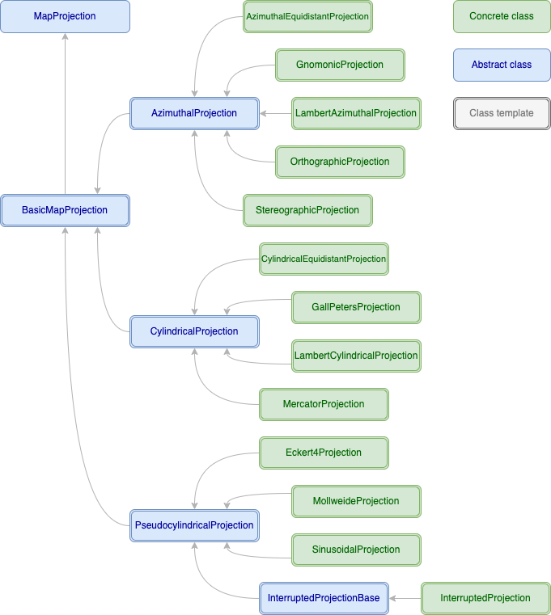

### Map projection base class

```c++
class MapProjection
```

All [map projection](https://en.wikipedia.org/wiki/Map_projection) classes
have this common base class, which provides properties that are independent
of the scalar type used for coordinates.

```c++
virtual MapProjection::~MapProjection() noexcept;
```

Life cycle operations. All concrete projection classes are default
constructible, copy and move constructible, and copy and move assignable
(these functions are not explicitly documented for the concrete classes to
avoid cluttering the documentation with repetitive boilerplate).

```c++
virtual std::string MapProjection::name() const;
```

The name of the projection.

```c++
virtual Maps MapProjection::properties() const noexcept;
```

The properties bitmask. This returns the same value as the concrete projection
class's `map_properties` constant, but is accessible through a base class
reference.

```c++
Maps MapProjection::family() const noexcept;
Maps MapProjection::cover() const noexcept;
Maps MapProjection::shape() const noexcept;
```

These return the property flag from each property group. The value returned
from each of these will always have exactly one bit set.

### Map projection template

```c++
template <std::floating_point T> class BasicMapProjection: public MapProjection;
```

The common base class for all map projections with a specific scalar type.

```c++
using BasicMapProjection::value_type = T;
using BasicMapProjection::vector_type = Vector<T, 2>;
```

Member types.

```c++
static constexpr vector_type BasicMapProjection::default_origin = {0,pi/2};
```

The default origin (centre point) for maps, the point where the prime meridian
meets the equator, in spherical _(φ,θ)_ coordinates.

```c++
virtual std::shared_ptr<BasicMapProjection>
    BasicMapProjection::clone() const;
```

Returns a copy of a projection object.

```c++
virtual bool BasicMapProjection::has_min_x() const noexcept;
virtual bool BasicMapProjection::has_max_x() const noexcept;
virtual bool BasicMapProjection::has_min_y() const noexcept;
virtual bool BasicMapProjection::has_max_y() const noexcept;
virtual T BasicMapProjection::min_x() const noexcept;
virtual T BasicMapProjection::max_x() const noexcept;
virtual T BasicMapProjection::min_y() const noexcept;
virtual T BasicMapProjection::max_y() const noexcept;
```

These indicate whether the map has a finite size in each direction, and if so,
what the minimum and maximum values for `x` and `y` are. The `max/min_[xy]()`
functions will return zero if the corresponding `has_*()` function is false.
The `has_*()` functions do not normally need to be explicitly overridden,
because for most projections they can be statically deduced from the
properties bitmask.

The minimum values are currently redundant since all supported projection
types are symmetrical about the origin; the functions are included to allow
for future support of asymmetrical projections such as conic projections.

```c++
vector_type BasicMapProjection::globe_to_map
    (vector_type polar) const noexcept;
vector_type BasicMapProjection::map_to_globe
    (vector_type xy) const noexcept;
```

These provide the main functionality of a map projection class, converting in
either direction between spherical _(φ,θ)_ coordinates on the globe, and
Cartesian _(x,y)_ coordinates on the map. Results are unspecified (but not
undefined) if the input point is not on the map (i.e. if `is_on_globe(polar)`
or `is_on_map(xy)` is false, respectively).

```c++
bool BasicMapProjection::is_on_globe(vector_type polar) const noexcept;
```

Indicates whether a point on the globe's surface (expressed as _(φ,θ)_
spherical coordinates) is on the visible portion of the globe. For projections
with the `Maps::sphere` property this will always be true.

```c++
bool BasicMapProjection::is_on_map(vector_type xy) const noexcept;
```

Indicates whether a point on the map (expressed as _(x,y)_ Cartesian
coordinates) is part of the projection of the globe.

```c++
vector_type BasicMapProjection::origin() const noexcept;
```

Returns the map's centre point, expressed as _(φ,θ)_ spherical coordinates.
The _φ_ coordinate supplied to the constructor will be reduced to the _[0,2π)_
range; behaviour is undefined if the _θ_ coordinate is negative or greater
than _π_.

### Projection family intermediate base classes

```c++
template <std::floating_point T> class AzimuthalProjection:
    public BasicMapProjection<T>;
template <std::floating_point T> class CylindricalProjection:
    public BasicMapProjection<T>;
template <std::floating_point T> class PseudocylindricalProjection:
    public BasicMapProjection<T>;
```

Base classes for specific families of projections. All projections currently
implemented are derived from one of these; some of the infrastructure is in
place to support other projection families such as conic projections, but no
concrete projections of any other type are currently implemented.

## Azimuthal projection classes

### Azimuthal equidistant projection

```c++
template <std::floating_point T> class AzimuthalEquidistantProjection:
        public AzimuthalProjection<T> {
    static constexpr Maps map_properties =
        Maps::azimuthal | Maps::sphere | Maps::circle | Maps::hemisphere_circle;
    explicit AzimuthalEquidistantProjection(vector_type origin) noexcept;
};
```

[Azimuthal equidistant projection](https://en.wikipedia.org/wiki/Azimuthal_equidistant_projection),
also known as the Postel or zenithal equidistant projection.

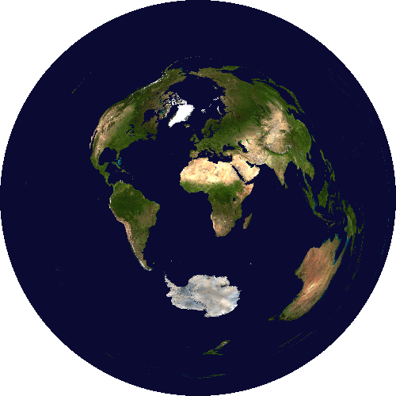

### Gnomonic projection

```c++
template <std::floating_point T> class GnomonicProjection:
        public AzimuthalProjection<T> {
    static constexpr Maps map_properties =
        Maps::azimuthal | Maps::sub_hemisphere | Maps::plane;
    explicit GnomonicProjection(vector_type origin) noexcept;
};
```

[Gnomonic projection](https://en.wikipedia.org/wiki/Gnomonic_projection).

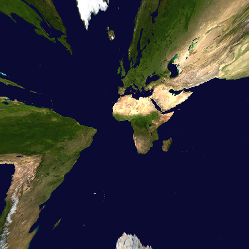

### Lambert azimuthal projection

```c++
template <std::floating_point T> class LambertAzimuthalProjection:
        public AzimuthalProjection<T> {
    static constexpr Maps map_properties =
        Maps::azimuthal | Maps::sphere | Maps::circle | Maps::equal_area
        | Maps::hemisphere_circle;
    explicit LambertAzimuthalProjection(vector_type origin) noexcept;
};
```

[Lambert azimuthal projection](https://en.wikipedia.org/wiki/Lambert_azimuthal_equal-area_projection),
also known as the azimuthal equal-area projection or Lambert zenithal equal-area projection.

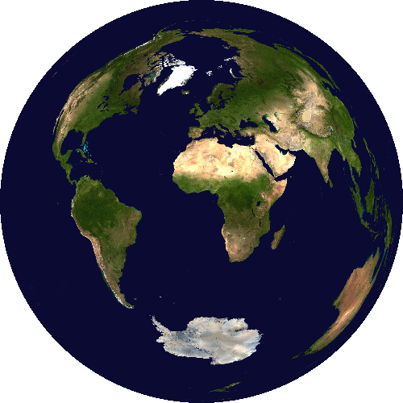

### Orthographic projection

```c++
template <std::floating_point T> class OrthographicProjection:
        public AzimuthalProjection<T> {
    static constexpr Maps map_properties =
        Maps::azimuthal | Maps::hemisphere | Maps::circle
        | Maps::hemisphere_circle;
    explicit OrthographicProjection(vector_type origin) noexcept;
};
```

[Orthographic projection](https://en.wikipedia.org/wiki/Orthographic_projection_in_cartography),
also known as the orthogonal projection.

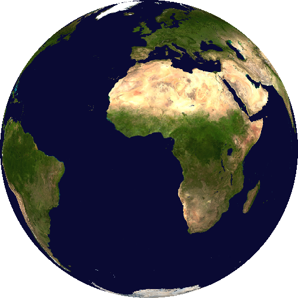

### Stereographic projection

```c++
template <std::floating_point T> class StereographicProjection:
        public AzimuthalProjection<T> {
    static constexpr Maps map_properties =
        Maps::azimuthal | Maps::sub_sphere | Maps::plane | Maps::conformal
        | Maps::hemisphere_circle;
    explicit StereographicProjection(vector_type origin) noexcept;
};
```

[Stereographic projection](https://en.wikipedia.org/wiki/Stereographic_projection).

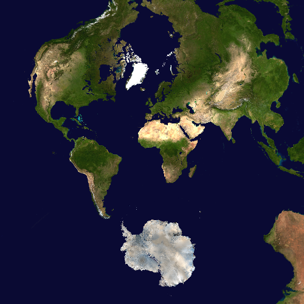

## Cylindrical projection classes

### Cylindrical equidistant projection

```c++
template <std::floating_point T> class CylindricalEquidistantProjection:
        public CylindricalProjection<T> {
    static constexpr Maps map_properties =
        Maps::cylindrical | Maps::sphere | Maps::rectangle;
    explicit CylindricalEquidistantProjection(vector_type origin) noexcept;
};
```

[Cylindrical equidistant projection](https://en.wikipedia.org/wiki/Equirectangular_projection),
also known as the equirectangular projection, geographic projection, plate carrée projection, or simple cylindrical projection.

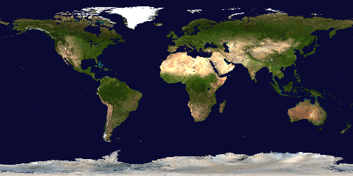

### Gall-Peters projection

```c++
template <std::floating_point T> class GallPetersProjection:
        public CylindricalProjection<T> {
    static constexpr Maps map_properties =
        LambertCylindricalProjection<T>::map_properties;
    explicit GallPetersProjection(vector_type origin) noexcept;
};
```

[Gall-Peters projection](https://en.wikipedia.org/wiki/Gall–Peters_projection),
also known as the Gall orthographic projection.

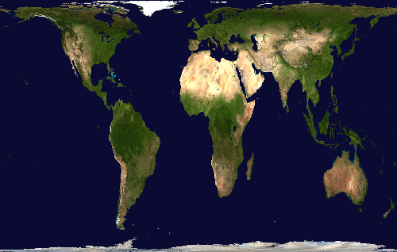

### Lambert cylindrical projection

```c++
template <std::floating_point T> class LambertCylindricalProjection:
        public CylindricalProjection<T> {
    static constexpr Maps map_properties =
        Maps::cylindrical | Maps::sphere | Maps::rectangle | Maps::equal_area;
    explicit LambertCylindricalProjection(vector_type origin) noexcept;
};
```

[Lambert cylindrical projection](https://en.wikipedia.org/wiki/Lambert_cylindrical_equal-area_projection),
also known as the cylindrical equal-area projection.

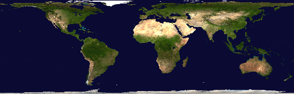

### Mercator projection

```c++
template <std::floating_point T> class MercatorProjection:
        public CylindricalProjection<T> {
    static constexpr Maps map_properties =
        Maps::cylindrical | Maps::sub_sphere | Maps::other_shape
        | Maps::conformal;
    explicit MercatorProjection(vector_type origin) noexcept;
};
```

[Mercator projection](https://en.wikipedia.org/wiki/Mercator_projection).

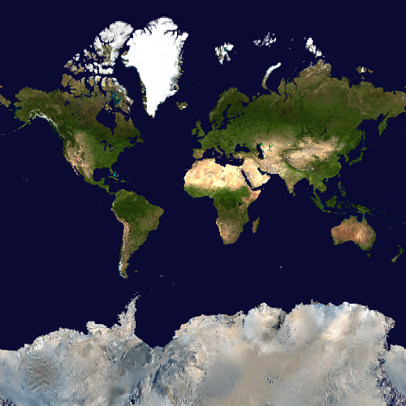

## Pseudo-cylindrical projection classes

### Eckert IV projection

```c++
template <std::floating_point T> class Eckert4Projection:
        public PseudocylindricalProjection<T> {
    static constexpr Maps map_properties =
        Maps::pseudocylindrical | Maps::sphere | Maps::other_shape
        | Maps::equal_area | Maps::numerical;
    explicit Eckert4Projection(vector_type origin) noexcept;
};
```

[Eckert IV projection](https://en.wikipedia.org/wiki/Eckert_IV_projection).

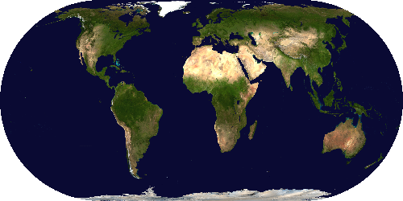

### Mollweide projection

```c++
template <std::floating_point T> class MollweideProjection:
        public PseudocylindricalProjection<T> {
    static constexpr Maps map_properties =
        Maps::pseudocylindrical | Maps::sphere | Maps::ellipse | Maps::equal_area
        | Maps::hemisphere_circle | Maps::numerical;
    explicit MollweideProjection(vector_type origin) noexcept;
};
```

[Mollweide projection](https://en.wikipedia.org/wiki/Mollweide_projection),
also known as the Babinet projection, elliptical equal-area projection, or homolographic projection.


### Sinusoidal projection

```c++
template <std::floating_point T> class SinusoidalProjection:
        public PseudocylindricalProjection<T> {
    static constexpr Maps map_properties =
        Maps::pseudocylindrical | Maps::sphere | Maps::other_shape
        | Maps::equal_area;
    explicit SinusoidalProjection(vector_type origin) noexcept;
};
```

[Sinusoidal projection](https://en.wikipedia.org/wiki/Sinusoidal_projection),
also known as the Mercator equal-area projection or Sanson–Flamsteed projection.

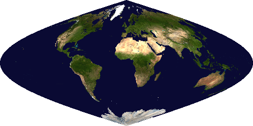

## Interrupted projection classes

```c++
template <std::floating_point T> class BasicInterruptedProjection:
        public PseudocylindricalProjection<T> {
    template <RangeType Range> void interrupt(const Range& inter);
    template <RangeType Range> void interrupt(const Range& inter_north,
        const Range& inter_south);
};
template <typename Projection> class InterruptedProjection:
        public BasicInterruptedProjection<Projection::value_type> {
    using InterruptedProjection::projection_type = Projection;
    template <RangeType Range> InterruptedProjection(vector_type origin,
        const Range& inter);
    template <RangeType Range> InterruptedProjection(vector_type origin,
        const Range& inter_north, const Range& inter_south);
};
```

The InterruptedProjection class generates an interrupted version of a
pseudo-cylindrical projection. The `inter[_north/south]` arguments supply a
list of interruption points, expressed as _φ_ coordinates (longitude), either
for both hemispheres or for each hemisphere separately.

### Interrupted Eckert IV projection

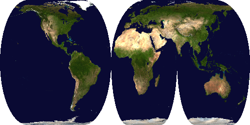

### Interrupted Mollweide projection

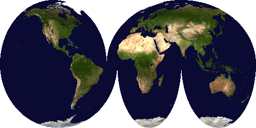

### Interrupted sinusoidal projection

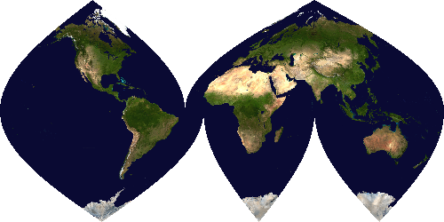
